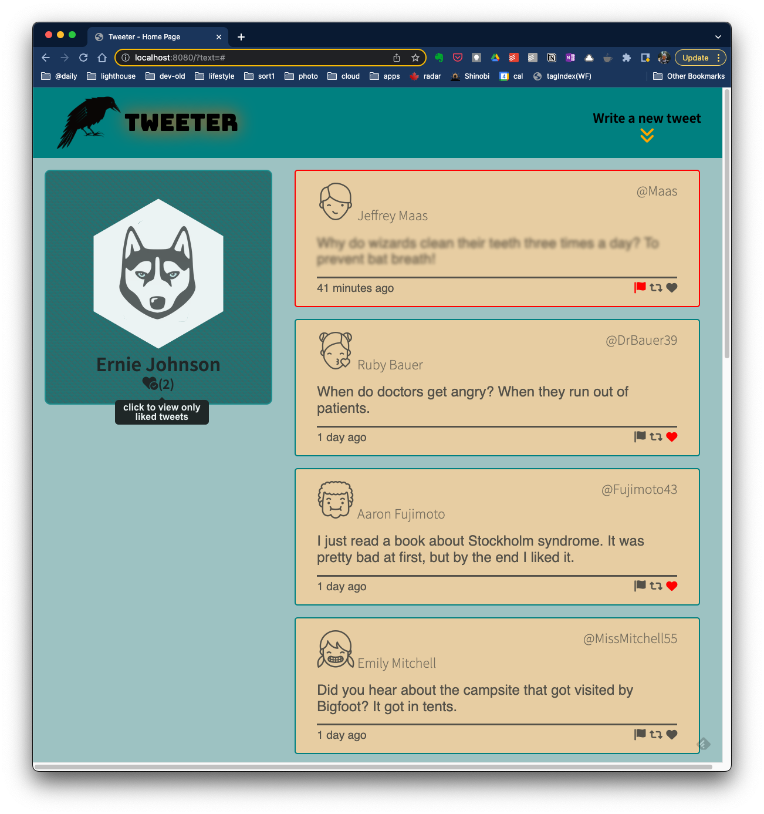
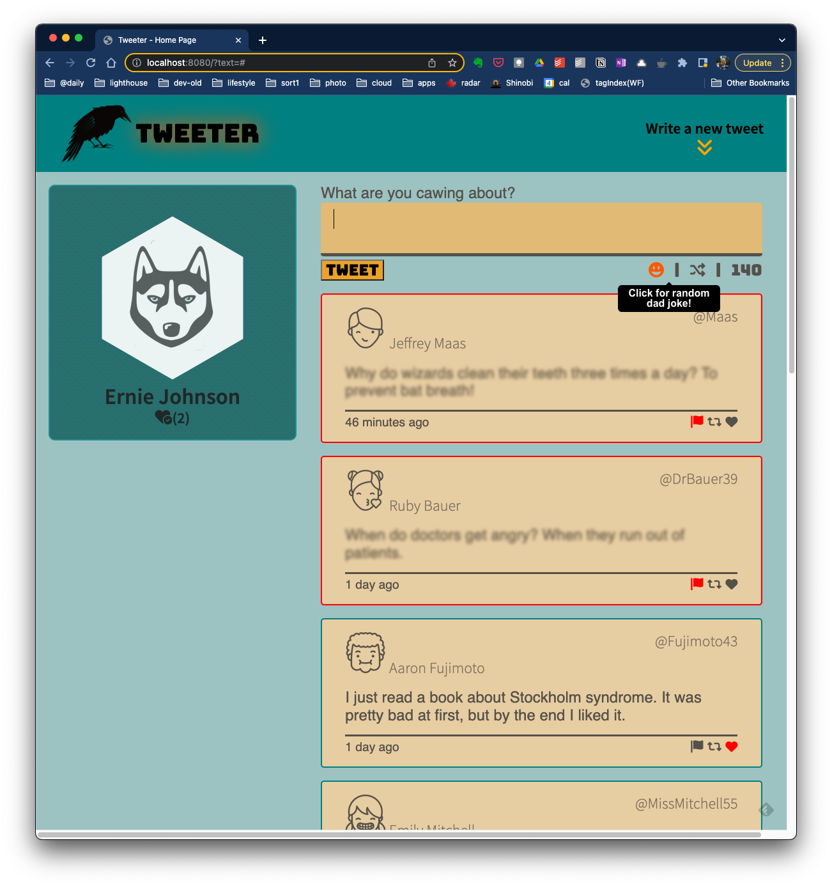
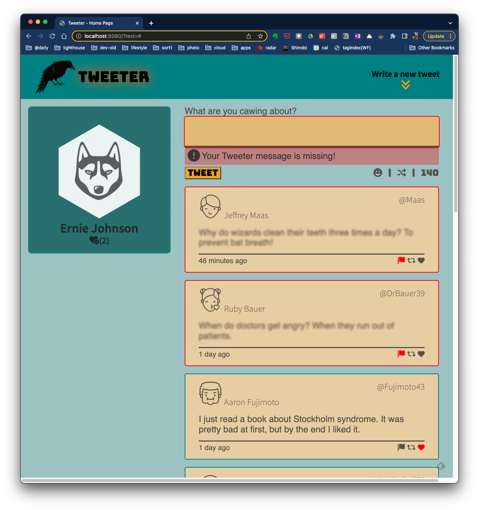
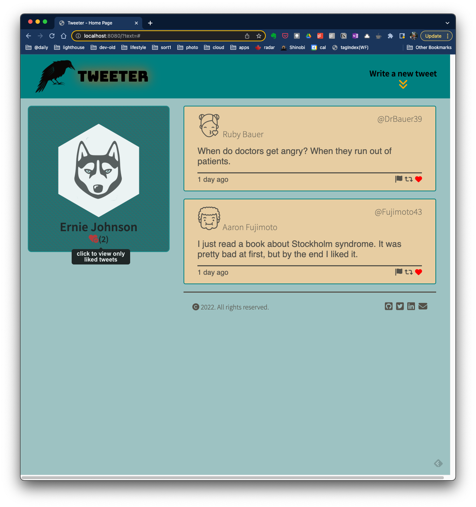
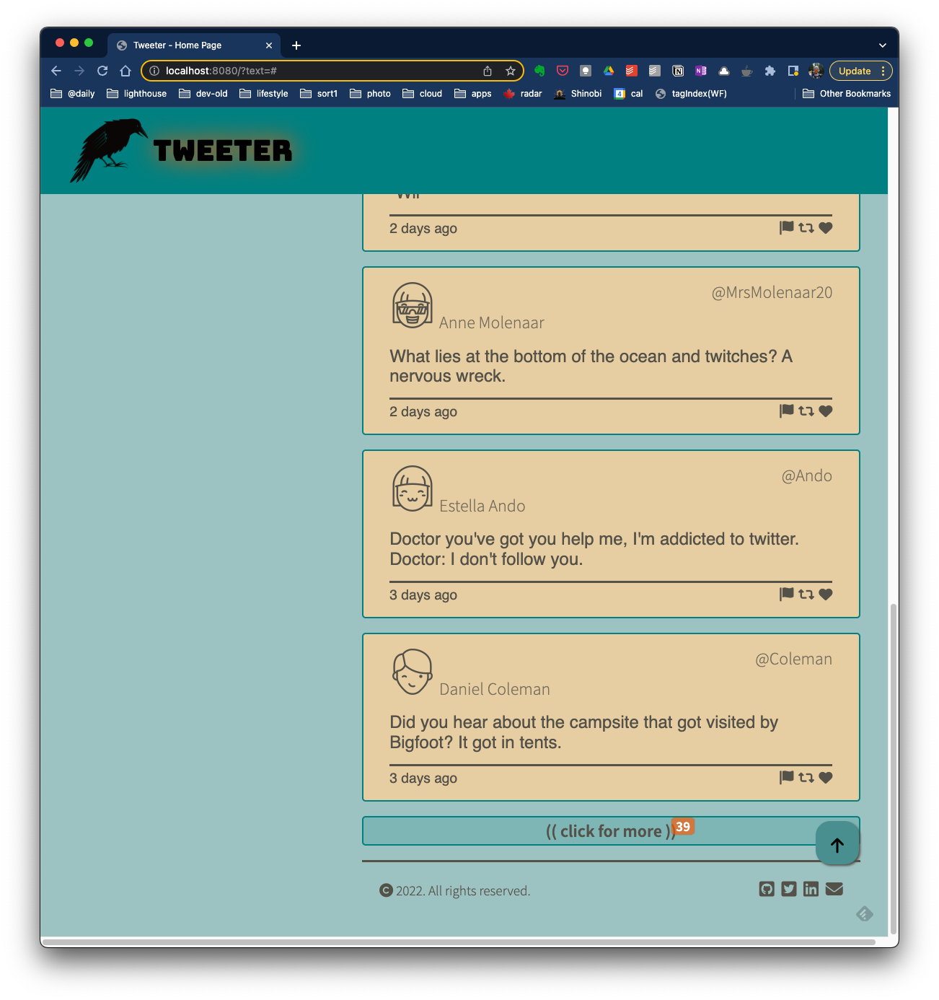

# Tweeter

Tweeter is a simple, single-page Twitter-type instant messaging clone.

It is derived from the <a href="www.lighthouselabs.ca">Lighthouse Labs</a> (LHL) full stack web development bootcamp project.

  

--- 
## Contents...  
1. [Features](#features)
2. [Extra Features](#extra-features)
3. [Future Plans](#future-plans)
4. [Quick Start](#quick-start)
5. [Detailed Operation](#detailed-operation)
6. [Known Bugs](#known-bugs)
7. [Attributions](#attributions)
8. [Updates](#updates)
--- 
## Features...  

- Mobile & desktop friendly.
  - mobile view under 1024 pixels wide
  - footer adjustment under 550 pixels wide   
- Slide open 'tweet box'.
- Slide open/closed error messages.  
[( back to top 🔺)](#tweeter)
---
## Extra Features...
- Can't think of what to "caw" about? Just hit the randomizer icon!
- Badge counter shows # of tweets below current position.
- Added "tool tips" at various locations.
- Added "hand" pointer over top right nav items (CSS).
- Added 'random dad jokes' generator with API call to "icanhazdadjoke.com".
- Added function to 'report' flag - flags goes red & blurs 'offensive' tweet.
- Added function to 'heart' icon - toggles state red or normal.
- Added function to 'retweet' icon - turns icon red & copies message to tweet input form.  
- Added pagination to showing tweets - displays 10 at a time then link (with counter) to show next group (10 at a time).
- Added count of liked tweets.
- Added view only "liked (heart)" tweets (click again for normal view)  
[( back to top 🔺)](#tweeter)
--- 
## Future Plans...
- update 'dad joke' API fetch to be asychnronous  
[( back to top 🔺)](#tweeter)
--- 
## Quick Start...  
- Once you've cloned the repo to your computer, run ```npm start``` to enable the server side of Tweeter.
- Open a browser to ```localhost:8080``` and Tweeter will be all set to to go!  
[( back to top 🔺)](#tweeter)
--- 
## Detailed Operation...  
- Start your tweeter server from the command line with ```npm start```
- Once that is running (it responds only with "Example app listening on port 8080), you can open a web browser window to ```localhost:8080``` to get started with Tweeter!

- From the main window, you can experiment with a few built in sample tweets, or start creating your own by clicking the double down chevrons in the top right to open the tweet message form.  We've incorporated extra features such as "like", "retweet" and "report" this tweet, along with tweet generators from the ICanHazDadJoke API and just a few random ones in our built in database. 


- Clicking the smiley face icon gets you a "Dad Joke", while the shuffle arrows pull a random quote from our internal database.  The numbers represent the characters remaining in your tweet message.


- A tweet must be less than 140 characters, and of course, greater than zero characters!


- If "liking" tweets, you can quickly view your favorites, by clicking the heart icon under your avatar image.  Click it again to return to the view of all tweets.


- We've determined that 10 tweets loaded at a time is plenty.  So if you've got more, scroll down and click the "more" link.  A badge icon shows you how many more older tweets remain to be viewed.


- Tweeter is also built to support both 'desktop' and 'mobile' devices.  Down scaling your window will cause Tweeter to adjust for a more suitable display.   
  
[( back to top 🔺)](#tweeter)
--- 
## Known Bugs...
- Return from liked tweets only" results in all tweets shown - pagination system breaks after this switch.
- V. scroll bar is forced 'always' on' to prevent page shift if only a few tweets on page.  
[( back to top 🔺)](#tweeter)
---
## Attributions...
- [TimeAgo](https://timeago.yarp.com/)
- [conColors](https://github.com/ej8899/conColors) (miscellaneous functions)
- FontAwesome
- Google Fonts
- Ajax
- Node.js
- JQuery  
[( back to top 🔺)](#tweeter)
---  
## Updates...
- Get the latest of our version of Tweeter on [Github here](https://github.com/ej8899/tweeter)!  
[( back to top 🔺)](#tweeter)
---
